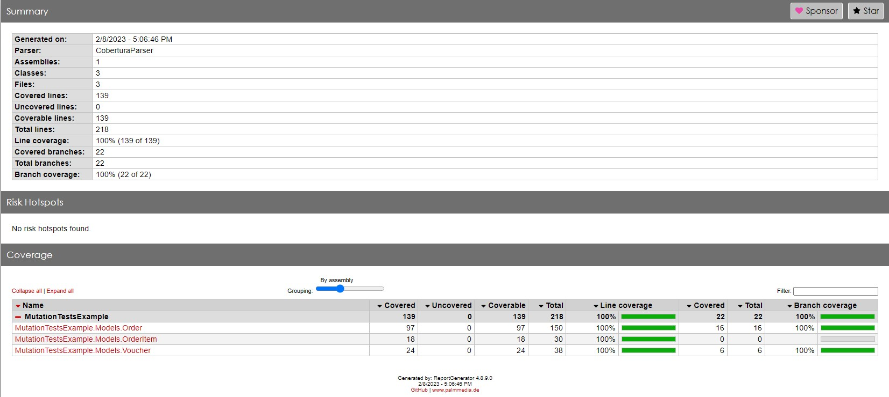
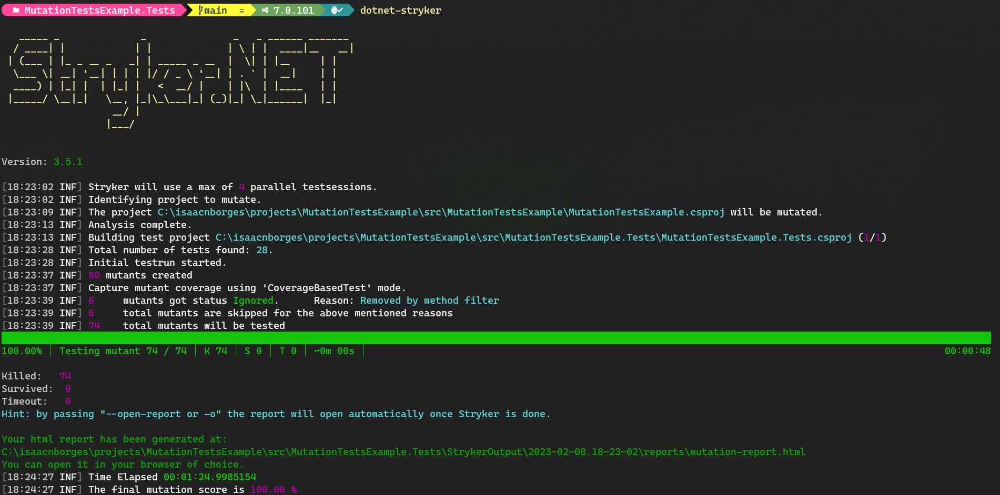
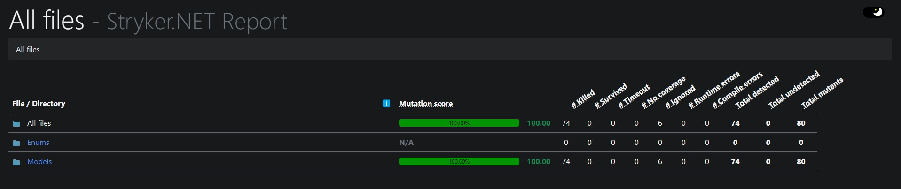

# Mutation Tests Example

This is a sample project that demonstrates how [Stryker .Net](https://github.com/stryker-mutator/stryker-net) can be used to run mutation tests in .Net Core.

To get more information about Stryker, you can view on [official website](https://stryker-mutator.io/).

## Project Dependencies 

- [.Net 7](https://dotnet.microsoft.com/download/dotnet/7.0)

## Generate coverage report
1. Colect coverage
```
dotnet test --verbosity minimal --collect:"XPlat Code Coverage"
```

2. Open folder with Guid inside TestResults
```
reportgenerator "-reports:coverage.cobertura.xml" "-targetdir:coveragereport" -reporttypes:Html
```

3. Open coveragereport folder
- open index.html file

### Code coverage report example


## Local Run

Go to the tests folder location: 

```
cd <repository location>\MutationTestsExample\src\MutationTestsExample.Tests
```

Install Stryker .NET globally:

```
dotnet tool install -g dotnet-stryker
```

Run the mutation tests:

```
dotnet-stryker
```

Run the mutation tests only with different file:

```
dotnet-stryker --diff
```

### Stryker .NET running



Go to the stryker report location: 

```
cd <repository location>\MutationTestsExample\src\MutationTestsExample.Tests\StrykerOutput\<date run report>\reports\mutation-report.html
```
### Stryker mutation score report
